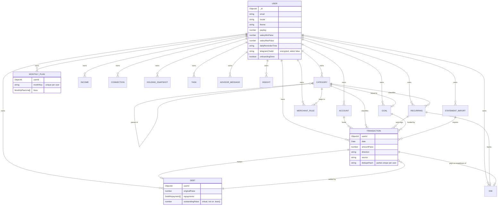

# Kaasu — Data Model

All 17 collections below live in MongoDB Atlas (`MONGODB_DB`, default `kaasu`), one document per
row, every collection scoped by `userId` (indexed) with Mongoose `timestamps: true`. Money fields
(`*Paise`) are integer paise (ADR-001); see `src/lib/db/schema-helpers.ts`'s `paiseField()` for the
shared validator and `src/lib/db/enums.ts` for the shared enum tuples reused by both the Mongoose
schemas and the Zod input schemas in each feature's `schema.ts`.

## Overview by group

- **Identity & preferences**: `User` is the account root; its `_id` is the `userId` on every other
  document. It also carries app preferences (locale, theme, payday, expected salary range, daily
  reminder time, an encrypted Telegram chat id, onboarding status).
- **Money movement**: `Account` (where money lives), `Category` (how it's classified — system
  defaults are seeded per user, see below), `Transaction` (every debit/credit, optionally linked to
  a `Recurring`, `Debt`, `Goal`, or `StatementImport`), `Recurring` (fixed/subscription/EMI/SIP
  templates), `Income`.
- **Budgeting**: `MonthlyPlan`, one per `(userId, monthKey)`, with embedded budget `lines`.
- **Debt**: `Debt` (person/credit-line/card/loan, with embedded `repayments`), `Emi` (fixed-tenure
  loans with embedded `installments`, optionally linked back to a `Recurring`).
- **Goals**: `Goal`, optionally linked to a `Category` for progress tracking.
- **Bank statements**: `StatementImport` (one row per uploaded file) and `MerchantRule` (learned
  merchant → category rules used during import; see ADR-014 for why `pattern` is never compiled as
  a live regex).
- **Investments**: `Connection` (a linked third-party account, e.g. INDstocks — token encrypted,
  read-only per CLAUDE.md §2.5) and `HoldingSnapshot` (a point-in-time portfolio snapshot with
  embedded `holdings` and `totals`).
- **Assistant & advisor**: `Task` (assistant/manual/Telegram to-dos), `AdvisorMessage` (chat
  history), `Insight` (generated observations, one per `(userId, type, periodKey)`).

## Entity relationships

## Notable design decisions

- **`Transaction.dedupeHash`** is a unique `(userId, dedupeHash)` index, computed only for
  `statement`/`telegram`/`ai` sources (`computeDedupeHash` in `src/features/expenses/service.ts`).
  Manual and recurring entries never get one, so legitimate same-day/same-amount duplicates are
  never blocked. It's a **partial** index (`partialFilterExpression`), not `sparse` — a compound
  `sparse` index only excludes a document when *every* indexed field is missing, and `userId` is
  always present, so `sparse` alone silently indexed every transaction. See ADR-013 and ADR-017
  (found by running `pnpm seed:demo` against a live cluster, not by inspection).
- **`Debt.outstandingPaise`** is a Mongoose virtual for convenience on hydrated documents, but
  virtuals don't survive `.lean()` — every read helper in `src/features/debts/queries.ts` computes
  it manually via the same pure function (`computeOutstandingPaise`), which is unit-tested directly.
- **Default categories** (17, Tamil + English, icon, colour, needs/wants/savings/debt group) are a
  single source of truth in `src/features/settings/service.ts` (`DEFAULT_CATEGORIES`), copied into
  a new user's `Category` collection idempotently (`ensureDefaultCategories`) both on first sign-in
  (`src/lib/auth.ts`) and by `scripts/seed-demo.ts`.
